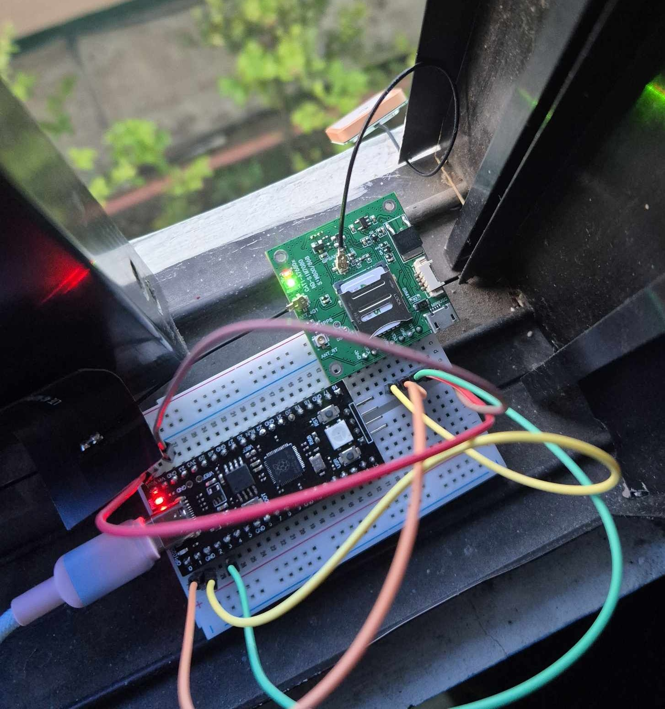
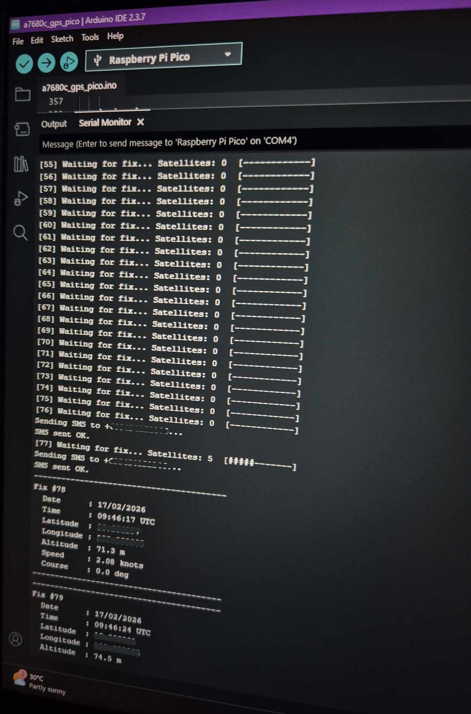
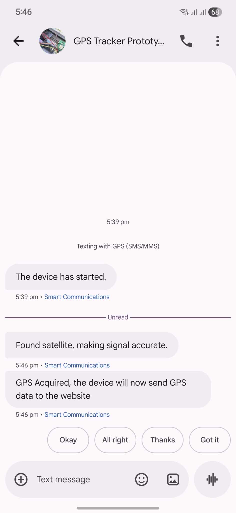

# A7680C GPS Tracker - Pi Pico (Arduino IDE)

A GPS tracker built with a Raspberry Pi Pico and SIMCom A7680C module.
Reads GPS coordinates, displays satellite status, sends SMS notifications,
and exposes a utility hook for sending data to a web API.

# Example Output (Serial Monitor):

```
=== A7680C GPS Tracker on Pi Pico ===

Pulsing PWRKEY to boot A7680C...
PWRKEY released. Waiting for module to boot...
Initialising A7680C ...

Attempt 1/10 - Contacting module... OK! Module is alive.
Sending SMS to +639XXXXXXXXX...
SMS sent OK.
GNSS power ON. Searching for satellites...
[1] Waiting for fix... Satellites: 0  [------------]
[2] Waiting for fix... Satellites: 0  [------------]
Sending SMS to +639XXXXXXXXX...
SMS sent OK.
[3] Waiting for fix... Satellites: 5  [#####-------]
Sending SMS to +639XXXXXXXXX...
SMS sent OK.
----------------------------------------
Fix #4
  Date      : 17/02/2026
  Time      : 09:46:17 UTC
  Latitude  : XX.XXXXXX
  Longitude : XXX.XXXXXX
  Altitude  : 71.3 m
  Speed     : 2.08 knots
  Course    : 0.0 deg
----------------------------------------
```

---

## Table of Contents

- [Hardware Requirements](#hardware-requirements)
- [Wiring](#wiring)
- [Voltage Divider (Arduino Nano only)](#voltage-divider-arduino-nano-only)
- [Software Requirements](#software-requirements)
- [Arduino IDE Setup](#arduino-ide-setup)
- [Configuration](#configuration)
- [Uploading the Sketch](#uploading-the-sketch)
- [Serial Monitor Output](#serial-monitor-output)
- [SMS Notifications](#sms-notifications)
- [Sending GPS Data to a Web API](#sending-gps-data-to-a-web-api)
- [AT Commands Reference](#at-commands-reference)
- [Troubleshooting](#troubleshooting)
- [Expanding the Project](#expanding-the-project)
- [Photo Documentation](#photo-documentation)

---

## Hardware Requirements

| Component             | Details                                                |
| --------------------- | ------------------------------------------------------ |
| Raspberry Pi Pico     | Standard Pico (RP2040)                                 |
| SIMCom A7680C         | GPS + LTE Cat-1 module                                 |
| External power supply | **3.7V–4.2V** (e.g. LiPo battery or DC regulator)      |
| Jumper wires          | Male-to-male or male-to-female depending on your board |

> ⚠️ **Do NOT power the A7680C from the Pico's 3.3V pin.** The module requires
> 3.4V–4.2V at up to 2A peak. Using the Pico's onboard regulator will cause
> the module to fail silently with no UART response.

---

## Wiring

### Pi Pico ↔ A7680C

```
Pi Pico               A7680C
─────────────────────────────────────
Pin 1  (GP0)  ──────► RX
Pin 2  (GP1)  ◄─────── TX
Pin 4  (GP2)  ──────► PWRKEY
Pin 3  (GND)  ──────── GND  ◄──── External supply GND
Pin 36 (3V3)  ──────── (do NOT use for VCC)

External supply (+)  ─► VCC
External supply (-)  ─► GND (also connect to Pico GND)
```

> ⚠️ **The GND of your external supply must be connected to the Pico GND.**
> Without a shared ground, serial communication will not work.

### PWRKEY Boot Behaviour

The A7680C will not turn on automatically when powered. The PWRKEY pin must be
pulled HIGH for ~1.5 seconds to boot the module. The code handles this
automatically on startup.

If the Pico resets while the module is already on, the PWRKEY pulse will
toggle it off. To avoid this, always power the Pico and A7680C together at
the same time.

---

## Voltage Divider (Arduino Nano only)

The Arduino Nano outputs 5V logic on TX pins. The A7680C RX pin is rated for
3.3V only. A voltage divider is required on the wire from Nano D11 → A7680C RX.

```
Nano D11 ──[ 1kΩ ]──┬── A7680C RX
                     │
                   [ 2kΩ ]
                     │
                    GND
```

The wire from A7680C TX → Nano D10 (receive) does **not** need a divider.
3.3V signals are safely readable by the Nano.

---

## Software Requirements

- [Arduino IDE 2.x](https://www.arduino.cc/en/software)
- Raspberry Pi Pico board package (see setup below)

---

## Arduino IDE Setup

### Step 1 — Add the Pico board package URL

1. Open Arduino IDE
2. Go to `File` → `Preferences`
3. Paste the following into **Additional Board Manager URLs**:

```
https://github.com/earlephilhower/arduino-pico/releases/download/global/package_rp2040_index.json
```

### Step 2 — Install the board package

1. Go to `Tools` → `Board` → `Board Manager`
2. Search for **Raspberry Pi Pico/RP2040**
3. Install **"Raspberry Pi Pico/RP2040 by Earle F. Philhower"**

### Step 3 — Select your board

```
Tools → Board → Raspberry Pi RP2040 Boards → Raspberry Pi Pico
```

### Step 4 — Select the serial port

```
Tools → Port → (select your Pico's COM port)
```

---

## Configuration

Open `a7680c_gps_pico.ino` and edit the configuration section at the top:

```cpp
// ── Configuration ───────────────────────────────────────────────
#define BAUD_RATE          115200
#define PWRKEY_PIN         2        // GP2 → A7680C PWRKEY
#define READ_TIMEOUT       10000    // ms to wait for AT response
#define POLL_INTERVAL      5000     // ms between GPS reads

// ── SMS Configuration ────────────────────────────────────────────
#define SMS_ENABLED        true
const String PHONE_NUMBER = "+639XXXXXXXXX";  // ← your number here
```

| Setting         | Description                                                   |
| --------------- | ------------------------------------------------------------- |
| `BAUD_RATE`     | UART baud rate — default is 115200                            |
| `PWRKEY_PIN`    | GPIO pin connected to A7680C PWRKEY                           |
| `POLL_INTERVAL` | How often to request GPS coordinates (milliseconds)           |
| `SMS_ENABLED`   | Set to `false` to disable all SMS (useful for testing)        |
| `PHONE_NUMBER`  | Recipient number in international format e.g. `+639XXXXXXXXX` |

---

## Uploading the Sketch

### First upload (blank Pico)

1. Hold the **BOOTSEL** button on the Pico
2. Plug the USB cable in while holding BOOTSEL
3. Release BOOTSEL — the Pico appears as a USB drive
4. Click **Upload** in Arduino IDE — it will flash automatically

### Subsequent uploads

Just click **Upload** normally. No need to hold BOOTSEL again once the
bootloader is installed.

---

## Serial Monitor Output

Open `Tools → Serial Monitor` and set baud rate to **115200**.

### Startup sequence

```
=== A7680C GPS Tracker on Pi Pico ===

Pulsing PWRKEY to boot A7680C...
PWRKEY released. Waiting for module to boot...
Initialising A7680C ...

Attempt 1/10 - Contacting module... OK! Module is alive.
GNSS power ON. Searching for satellites...
```

### Waiting for fix

```
[1]  Waiting for fix... Satellites: 3  [###---------]
[2]  Waiting for fix... Satellites: 6  [######------]
[3]  Waiting for fix... Satellites: 9  [#########---]
```

### GPS fix acquired

```
----------------------------------------
Fix #4
  Date      : 17/02/2026
  Time      : 09:13:19 UTC
  Latitude  : 9.517237
  Longitude : 123.684707
  Altitude  : 94.5 m
  Speed     : 0.77 knots
  Course    : 349.7 deg
----------------------------------------
```

---

## SMS Notifications

The device sends **3 SMS messages total** per power cycle. No repeats.

| #   | When                      | Message                                                            |
| --- | ------------------------- | ------------------------------------------------------------------ |
| 1   | Module boots and responds | `"The device has started."`                                        |
| 2   | First satellite detected  | `"Found satellite, making signal accurate."`                       |
| 3   | First GPS fix acquired    | `"GPS Acquired, the device will now send GPS data to the website"` |

> **Note:** A SIM card with SMS credit is required for SMS to work.
> GPS positioning works fine without a SIM card — only SMS and mobile data
> require one.

To disable SMS during testing:

```cpp
#define SMS_ENABLED false
```

---

## Sending GPS Data to a Web API

Every GPS fix is passed to the `onGpsData()` function. This is where you add
your HTTP POST, MQTT, or any other network logic.

```cpp
void onGpsData(const GpsData &gps) {
    // gps.latitude    — decimal degrees (e.g. 9.517237)
    // gps.longitude   — decimal degrees (e.g. 123.684707)
    // gps.altitude    — meters
    // gps.speedKnots  — speed over ground in knots
    // gps.course      — heading in degrees
    // gps.date        — raw string ddmmyy
    // gps.utcTime     — raw string hhmmss.ss

    // ── TODO: HTTP POST ──────────────────────────────────────────
    // Uncomment and fill in once your server/SIM data is ready:
    //
    // String payload = "{";
    // payload += "\"lat\":"  + String(gps.latitude,  6) + ",";
    // payload += "\"lon\":"  + String(gps.longitude, 6) + ",";
    // payload += "\"alt\":"  + String(gps.altitude,  1) + ",";
    // payload += "\"spd\":"  + String(gps.speedKnots,2);
    // payload += "}";
    // httpPost("https://your-api.com/location", payload);
}
```

The A7680C supports HTTP/HTTPS via AT commands (`AT+HTTPINIT`, `AT+HTTPPARA`,
`AT+HTTPACTION`). A SIM card with an active mobile data subscription is
required for this feature.

---

## AT Commands Reference

Commands used in this project (from A7680C manual section 24):

| Command              | Description                                  |
| -------------------- | -------------------------------------------- |
| `AT`                 | Check if module is responding                |
| `AT+CGNSSPWR=1`      | Power on the GNSS engine                     |
| `AT+CGPSINFO`        | Get GPS position (single-line response)      |
| `AT+CGNSSINFO`       | Get GNSS position including satellite counts |
| `AT+CMGF=1`          | Set SMS to text mode                         |
| `AT+CMGS="<number>"` | Send SMS to number                           |
| `AT+IPR=<baud>`      | Set UART baud rate                           |

### AT+CGPSINFO response format

```
+CGPSINFO:<lat>,<N/S>,<lon>,<E/W>,<date>,<UTC>,<alt>,<speed>,<course>

Example with fix:
+CGPSINFO:1015.471638,N,12344.234064,E,170226,091318.00,94.5,0.77,349.7

No fix:
+CGPSINFO:,,,,,,,,
```

Coordinates are in `ddmm.mmmmmm` format and are automatically converted to
decimal degrees by the code.

---

## Troubleshooting

### Module not responding

| Symptom                       | Likely cause                       | Fix                                               |
| ----------------------------- | ---------------------------------- | ------------------------------------------------- |
| Empty raw response            | TX/RX wires swapped                | Swap the GP0 and GP1 connections                  |
| Response cuts off at 31 bytes | UART FIFO buffer too small         | `Serial1.setFIFOSize(256)` — already in code      |
| No response at all            | Wrong baud rate                    | Run the diagnostic sketch to auto-scan baud rates |
| No response at all            | Insufficient power                 | Use external 3.7–4.2V supply, not Pico 3.3V       |
| Module turns off on reset     | PWRKEY toggled while module was on | Power Pico and A7680C together                    |

### GPS not getting a fix

| Symptom                       | Likely cause             | Fix                                              |
| ----------------------------- | ------------------------ | ------------------------------------------------ |
| Satellites: 0 for a long time | Indoors with no sky view | Move near a window or go outside                 |
| Fix mode 3 but no coordinates | Still computing position | Wait — normal with few satellites                |
| Very slow first fix           | No SIM (no A-GPS assist) | Cold start without A-GPS takes 2–15 min outdoors |

### SMS not sending

| Symptom                              | Likely cause                     | Fix                                                |
| ------------------------------------ | -------------------------------- | -------------------------------------------------- |
| `SMS ERROR: Could not set text mode` | No SIM card inserted             | Insert a SIM with SMS credit                       |
| `SMS failed`                         | No signal or wrong number format | Check signal and use international format `+63...` |

### Running the diagnostic sketch

A separate `a7680c_diagnostic.ino` is included. Upload it first to:

- Auto-scan all common baud rates
- Print raw bytes received from the module
- Allow you to type AT commands manually via Serial Monitor

---

## Expanding the Project

The Pi Pico has plenty of interfaces remaining for additional modules:

| Interface       | Status        | Available for          |
| --------------- | ------------- | ---------------------- |
| UART0 (GP0/GP1) | Used — A7680C | —                      |
| UART1 (GP4/GP5) | Free          | Second serial device   |
| SPI0 (GP4–GP7)  | Free          | RFID RC522, display    |
| I2C0 (GP8/GP9)  | Free          | OLED display (SSD1306) |
| GPIO            | 23 pins free  | Buttons, LEDs, sensors |

### Recommended additions

**RFID Scanner (RC522)**

- Interface: SPI0
- Pins: GP4 (MISO), GP5 (CS), GP6 (SCK), GP7 (MOSI), GP3 (RST)
- Library: `MFRC522` in Arduino Library Manager

**OLED Display (SSD1306 0.96")**

- Interface: I2C0
- Pins: GP8 (SDA), GP9 (SCL)
- Library: `Adafruit SSD1306` in Arduino Library Manager
- Only 2 wires needed, runs on 3.3V

All three modules run on 3.3V — no level shifters needed when used with the Pi Pico.

## Photo Documentation

### Hardware:

I just connected everything directly without a resistor 😂


### Sample Output



### SMS Feature


